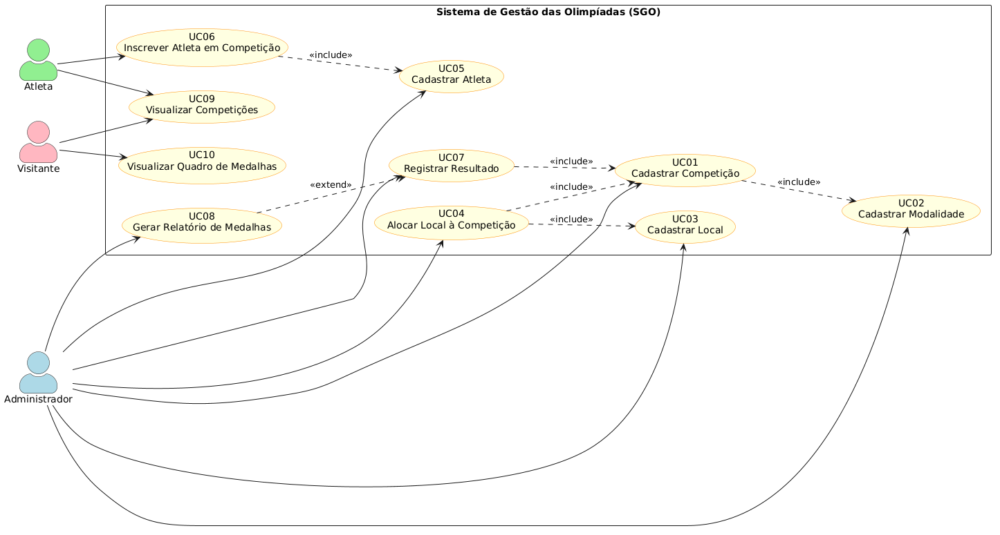
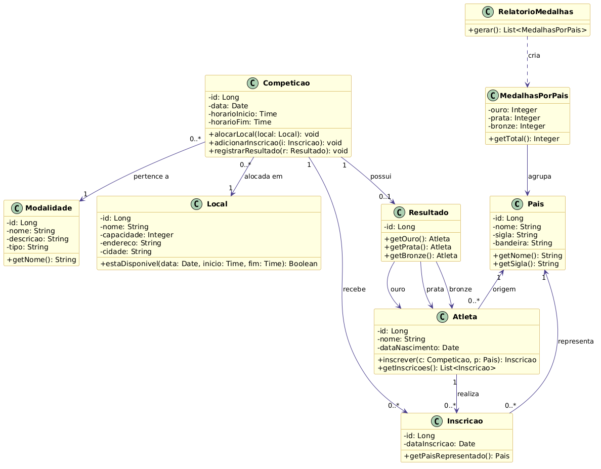
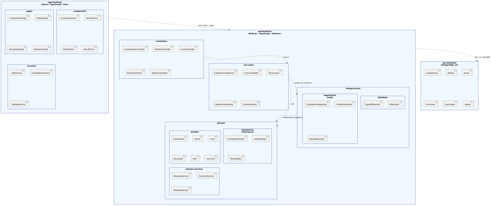
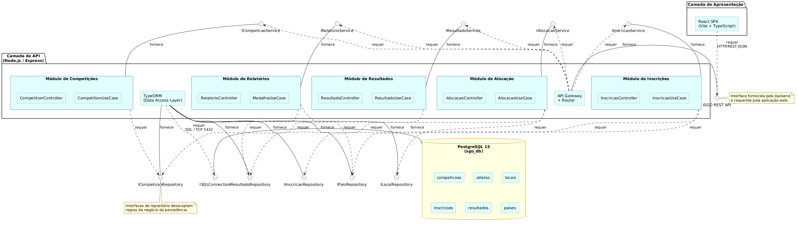
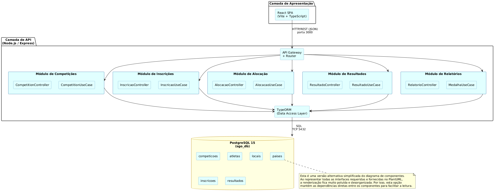
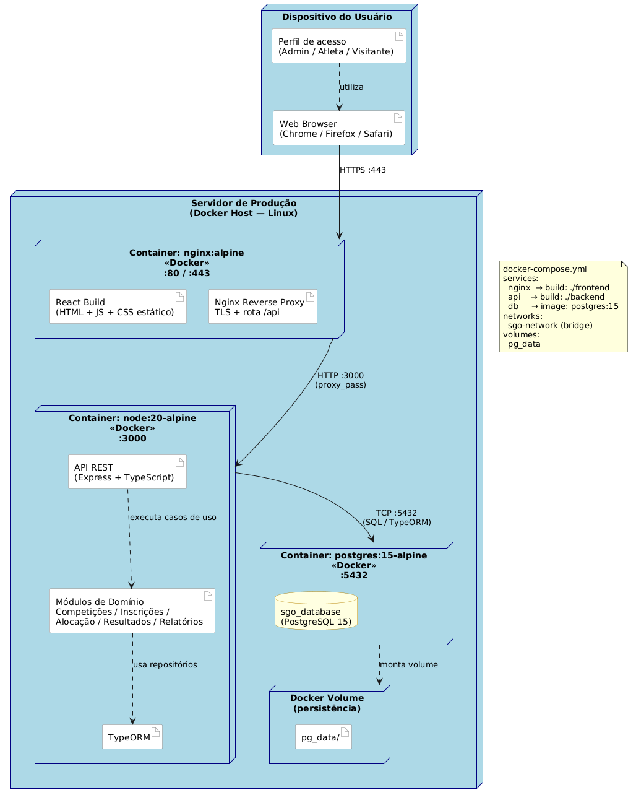

# Sistema de Gestão das Olimpíadas (SGO)

Modelagem UML desenvolvida para a disciplina de **Projeto de Software**, com foco no gerenciamento de competições olímpicas, inscrições de atletas, alocação de locais, registro de resultados e geração de relatório de medalhas por país.

Este projeto apresenta a documentação conceitual do sistema por meio de diagramas UML criados com **PlantUML**, conforme solicitado na atividade. Não há implementação de código-fonte do sistema, apenas a modelagem e a documentação necessárias para representar a solução proposta.

---

## Índice

- [Sobre o Projeto](#sobre-o-projeto)
- [Contexto Acadêmico](#contexto-acadêmico)
- [Objetivos do Sistema](#objetivos-do-sistema)
- [Atores do Sistema](#atores-do-sistema)
- [Regras de Negócio](#regras-de-negócio)
- [Histórias de Usuário](#histórias-de-usuário)
- [Diagramas UML](#diagramas-uml)
- [Arquivos PlantUML](#arquivos-plantuml)
- [Estrutura do Repositório](#estrutura-do-repositório)
- [Autores](#autores)

---

## Sobre o Projeto

O **Sistema de Gestão das Olimpíadas (SGO)** tem como objetivo apoiar a organização e o acompanhamento das competições olímpicas, centralizando as informações necessárias para administrar modalidades, atletas, países, locais de prova, inscrições, resultados e relatórios de medalhas.

Por meio do sistema, a organização do evento pode cadastrar competições informando modalidade, data, horário e local, além de controlar quais atletas estão inscritos em cada prova. O SGO também deve garantir que os locais sejam alocados sem conflitos de horário, impedindo que duas competições ocorram no mesmo espaço ao mesmo tempo.

Os atletas podem participar de diferentes competições, desde que respeitem a regra de representar apenas um país em cada modalidade. Após a realização das provas, o sistema permite registrar os resultados oficiais, indicando os atletas classificados em primeiro, segundo e terceiro lugares. Com base nesses resultados, é possível gerar o quadro de medalhas, agrupando o desempenho dos países por medalhas de ouro, prata e bronze.

O foco deste repositório é representar a estrutura, os comportamentos principais, as responsabilidades dos módulos e a distribuição conceitual da solução por meio dos seguintes diagramas:

- Diagrama de Caso de Uso
- Diagrama de Classes
- Diagrama de Pacotes
- Diagrama de Componentes
- Diagrama de Implantação

---

## Contexto Acadêmico

| Informação | Descrição |
|-----------|-----------|
| Curso | Engenharia de Software |
| Disciplina | Projeto de Software |
| Professor | João Paulo Carneiro Aramuni |
| Trabalho | Trabalho 1 - Primeira Entrega |
| Tema | Sistema de Gestão das Olimpíadas |
| Valor | 10 pontos |

---

## Objetivos do Sistema

- Permitir o cadastro e a organização de competições olímpicas.
- Controlar a inscrição de atletas em competições específicas.
- Garantir que cada atleta represente apenas um país por modalidade.
- Alocar locais de competição evitando conflitos de data e horário.
- Registrar os resultados oficiais das competições.
- Gerar relatório de medalhas por país, considerando ouro, prata e bronze.
- Representar a arquitetura lógica e física do sistema por meio de diagramas UML.

---

## Atores do Sistema

| Ator | Responsabilidade |
|------|------------------|
| Administrador | Gerencia competições, modalidades, locais, atletas, resultados e relatórios. |
| Atleta | Consulta competições, realiza inscrições e acompanha seus resultados. |
| Visitante | Consulta competições e acompanha o quadro de medalhas. |

---

## Regras de Negócio

1. **Cadastro de competições:** o sistema deve permitir o cadastro de competições com modalidade, data, horário, local e lista de atletas inscritos.
2. **Inscrição de atletas:** atletas de diferentes países podem se inscrever em competições específicas.
3. **Participação em múltiplas competições:** cada atleta pode participar de várias competições.
4. **Representação por modalidade:** um atleta só pode representar um país em cada modalidade.
5. **Alocação de locais:** um local só pode abrigar uma competição por vez.
6. **Prevenção de conflitos:** o sistema deve impedir a alocação de duas competições no mesmo local e horário.
7. **Registro de resultados:** após a realização das competições, devem ser registrados o primeiro, segundo e terceiro colocados.
8. **Relatório de medalhas:** o sistema deve gerar relatórios mostrando o desempenho dos países com base nas medalhas conquistadas.

---

## Histórias de Usuário

| ID | Ator | Como... | Quero... | Para... |
|----|------|---------|----------|---------|
| US01 | Administrador | administrador do sistema | cadastrar competições com modalidade, data, horário e local | organizar o calendário olímpico |
| US02 | Administrador | administrador do sistema | alocar um local a uma competição verificando disponibilidade de horário | evitar conflitos de agenda entre competições |
| US03 | Administrador | administrador do sistema | registrar o resultado de uma competição com 1º, 2º e 3º colocados | documentar os vencedores oficialmente |
| US04 | Administrador | administrador do sistema | gerar o relatório de medalhas agrupado por país | divulgar o quadro olímpico atualizado |
| US05 | Administrador | administrador do sistema | cadastrar atletas com seus dados pessoais e país de origem | manter o cadastro de participantes |
| US06 | Administrador | administrador do sistema | cadastrar locais de competição com nome, capacidade e endereço | disponibilizar locais para alocação |
| US07 | Atleta | atleta cadastrado no sistema | inscrever-me em uma competição escolhendo o país que vou representar naquela modalidade | participar oficialmente da modalidade olímpica |
| US08 | Atleta | atleta cadastrado no sistema | visualizar todas as competições com datas, horários e locais | planejar minha participação nas provas |
| US09 | Atleta | atleta cadastrado no sistema | consultar meus resultados nas competições em que participei | acompanhar meu desempenho olímpico |
| US10 | Visitante | visitante ou público geral | consultar o quadro de medalhas atualizado por país | acompanhar o desempenho das nações nas Olimpíadas |

---

## Diagramas UML

### Diagrama de Caso de Uso

Representa os principais atores do sistema e suas interações com as funcionalidades essenciais do SGO, como cadastrar competição, inscrever atleta, alocar local, registrar resultado e gerar relatório de medalhas.



### Diagrama de Classes

Representa a estrutura principal do domínio do sistema, incluindo classes como `Competicao`, `Atleta`, `Local`, `Resultado`, `Pais`, `Inscricao` e `Modalidade`, além de seus relacionamentos e restrições de negócio.



### Diagrama de Pacotes

Organiza o sistema em pacotes lógicos, separando responsabilidades como apresentação, controllers, casos de uso, domínio, repositórios, infraestrutura e banco de dados.



### Diagrama de Componentes - Opção Principal

Mostra os principais componentes do sistema e suas interações por meio de interfaces fornecidas e requeridas, evidenciando quais módulos consomem e fornecem serviços dentro da arquitetura.



### Diagrama de Componentes - Segunda Opção Sem Requisições

Versão simplificada do diagrama de componentes, sem interfaces requeridas e fornecidas, mantendo dependências diretas entre os módulos para facilitar a leitura.

> Observação: ao representar todas as interfaces requeridas e fornecidas no PlantUML, a renderização fica muito poluída e desorganizada. Por isso, esta segunda opção também foi incluída como alternativa visual mais limpa.



### Diagrama de Implantação

Representa a distribuição física conceitual do sistema, incluindo dispositivo do usuário, servidor de aplicação, proxy, API, banco de dados e volume de persistência.



---

## Arquivos PlantUML

Os diagramas foram criados utilizando **PlantUML**. Os arquivos-fonte estão disponíveis na pasta `codigos/` e podem ser regenerados em formato PNG pelo script `gerar_imagens.py`.

| Diagrama | Arquivo PlantUML | Imagem |
|----------|------------------|--------|
| Caso de Uso | `codigos/diagrama-de-caso-de-uso.puml` | `imagens/diagrama-de-caso-de-uso.png` |
| Classes | `codigos/diagrama-de-classes.puml` | `imagens/diagrama-de-classes.png` |
| Pacotes | `codigos/diagrama-de-pacotes.puml` | `imagens/diagrama-de-pacotes.png` |
| Componentes | `codigos/diagrama-de-componentes.puml` | `imagens/diagrama-de-componentes.png` |
| Componentes sem requisições | `codigos/diagrama-de-componentes-sem-requisições.puml` | `imagens/diagrama-de-componentes-sem-requisições.png` |
| Implantação | `codigos/diagrama-de-implantacao.puml` | `imagens/diagrama-de-implantacao.png` |

Para regenerar as imagens:

```bash
python gerar_imagens.py
```

---

## Estrutura do Repositório

```text
sistema-gestao-olimpiadas/
├── README.md
├── gerar_imagens.py
├── imagens/
│   ├── diagrama-de-caso-de-uso.png
│   ├── diagrama-de-classes.png
│   ├── diagrama-de-pacotes.png
│   ├── diagrama-de-componentes.png
│   ├── diagrama-de-componentes-sem-requisições.png
│   └── diagrama-de-implantacao.png
└── codigos/
    ├── diagrama-de-caso-de-uso.puml
    ├── diagrama-de-classes.puml
    ├── diagrama-de-pacotes.puml
    ├── diagrama-de-componentes.puml
    ├── diagrama-de-componentes-sem-requisições.puml
    └── diagrama-de-implantacao.puml
```

---

## Autores

| Nome |
|------|
| Mateus Ferrão |
| Felipe Fontenelle |
